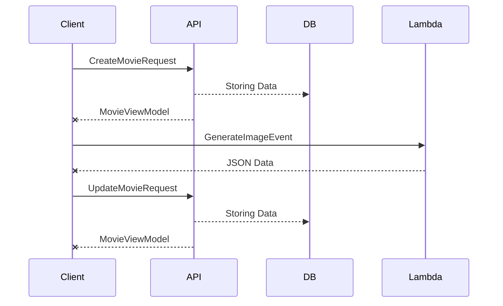
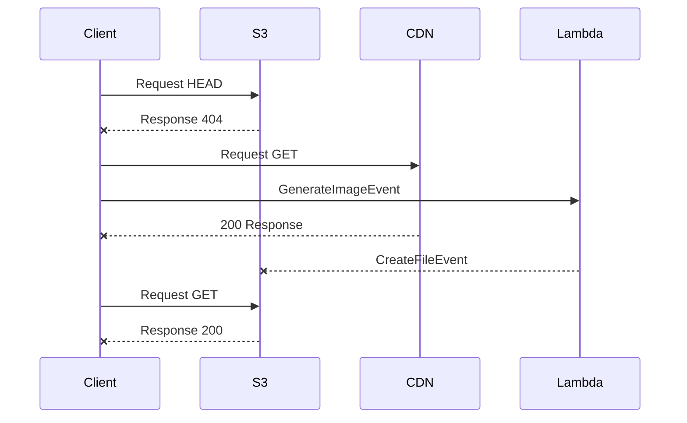

# Streaming Platform Prototype - REST API Backend

This is the backend of the Streaming Platform, developed with **Node.js** and **TypeScript**. It provides a RESTful API that manages business logic and handles interaction with the database and a separate microservice for image processing.

## Overview

The REST API is designed with a focus on efficiency and maintainability. It is built using clean architecture principles and design patterns, applying software development best practices to ensure it is robust and easy to extend.

### Tecnologías Utilizadas

- **Node.js**: Server platform used for backend development.
- **TypeScript**: Programming language that adds static typing to JavaScript.
- **hono.dev**: Lightweight library for handling HTTP requests, optimized for serverless environments.
- **AWS Lambda**: Serverless infrastructure to run the REST API.
- **Jest**: Unit testing framework, used to ensure code quality.
- **AWS S3**: Image storage and caching system to optimize content loading.

```plaintext
/src
/application #        Business logic and use cases
/domain #     Entities, value objects, and contracts
/infra #       Infrastructure implementation
/__tests__ #      Unit tests to verify code behavior
/tdd-reports #    Tdd reports and code coverage
```

## NPM Scripts 

```sh

npm run dev #start a local server in dev mode
npm run build # compile for production
npm run start  # run the server in production mode
npm run typeorm # typerorm cli interactions
npm run migration:generate path/to/name_file # generate new files for db changes
npm run migration:run # execute the db transactions
npm run migration:rollback # restore to back db state
npm run seed:create # create files to seed tables in db
npm run seed:run # execute seeders to fill  db
npm run test # run the unit tests with jest

```
## Client-Backend Interaction

> [!INFO]
> How is the communication for create a new Movie Entity


> [!INFO]
> How works Cache Images Strategy

